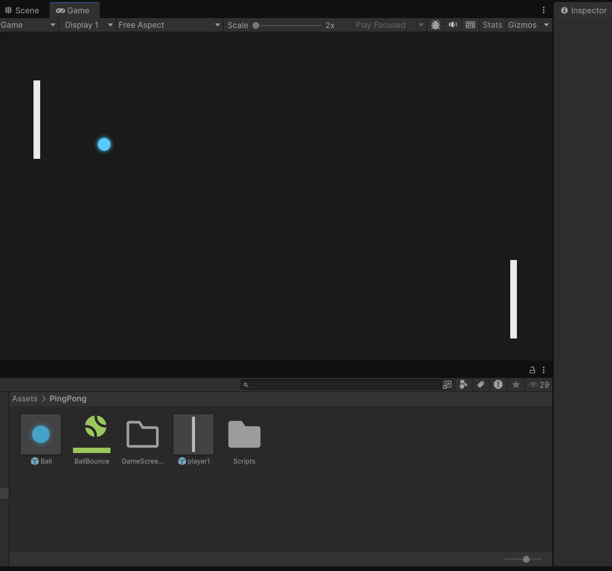

# ★ ARCADE PONG GAME ★

Simple Arcade Pong style 2D game made in **Unity** using **C#**.

---

## 🎮 Controls

| Action        | Key / Input |
|--------------|-------------|
| Move player 1 | `W` / `S`   |
| Move player 2 | `↑` / `↓`   |
| Pause/Restart | `Esc`       |

---

## 🛠 Tech Stack

- **Engine:** Unity (2D project)
- **Language:** C#
- **IDE:** VS Code
- **Platform:** PC
- **Assets:** 2D Game Assets – Brackeys  
- **Tutorial Base:** 2D Game – Brackeys

---

## 📸 Screenshots

---

Made by **bushinoni**  Unity & C# 🏓
